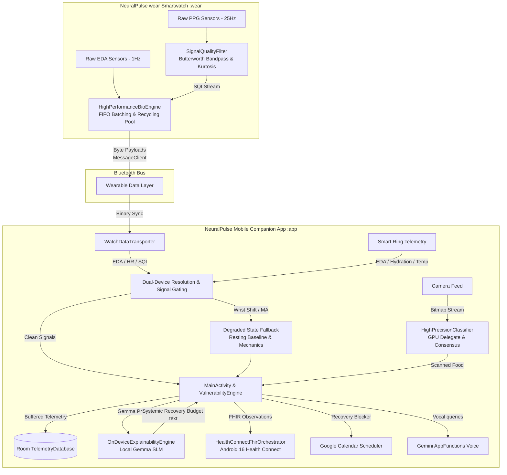

# NeuralPulse Ecosystem

[](https://kotlinlang.org/)
[](https://developer.android.com/)
[](https://developer.android.com/wear)
[](https://developer.android.com/jetpack/compose)
[](https://sqlite.org/)
[](https://www.smartthings.com/)
[](https://hl7.org/fhir/)
[](https://gradle.org/)

NeuralPulse is a premium, clinical-grade health monitoring ecosystem combining the NeuralPulse companion mobile app for Android 15+ and the standalone NeuralPulse wear application for Wear OS 5+. It combines high-frequency wearable biometric digital signal processing (DSP) with local on-device computer vision and natural language processing (NLP) models, keeping health telemetry highly performant, private, and secure.

---

## Technology Stack

- **Mobile Client**: Android 15 / 16 (Kotlin, Jetpack Compose, Material 3)
- **Watch Client**: Wear OS 5+ / Samsung One UI 6 Watch (Jetpack Compose for Wear OS)
- **Computer Vision & NLP**: Google MediaPipe tasks-vision (INT8 Quantized MobileNetV3) & tasks-genai (Local Gemma model)
- **Database**: Room SQLite with batched write transactions
- **System Interoperability**: Android 16 Health Connect with FHIR R4 observations schema
- **Biometric API**: Samsung Health SDK (libs/samsung-health-data-api.aar)

---

## System Architecture

The ecosystem leverages the Wearable Data Layer API to sync biometric data from the watch to the phone, resolves multi-device telemetry conflicts, processes local camera feeds, performs local language model inference, and exports validated records to the local Health Connect store.



---

## Subsystems and Edge Implementations

### 1. Standalone Smartwatch App (`:wear`)

#### Raw PPG Filtering & Signal Quality Index (SQI)
- **4th-Order Butterworth Bandpass Filter**: Polled raw PPG signals (25Hz) are passed through a digital bandpass filter (0.5 Hz - 4.0 Hz) to isolate blood pulse frequencies (30 - 240 BPM) and remove low-frequency physical movement noise.
- **Statistical Kurtosis Validation**: Analyzes a rolling 75-sample window (3 seconds of data) to calculate signal kurtosis. Pure physiological pulse waves maintain a statistical sharpness (kurtosis) coefficient between 2.8 and 5.2. Anything outside this boundary is flagged as motion noise (SQI = 0.0) and isolated.
- **Vascular Compliance Tracking (PTT)**: The VascularComplianceEngine calculates Pulse Transit Time (PTT) by measuring the millisecond delta between electrical depolarization (ECG R-Wave peak) and the peripheral blood volume pulse wave peak (PPG peak). Telemetry values are filtered using a strict 150 ms - 400 ms physiological range.
- **Wear OS 7 Proactive Ambient Engine**: Integrates Jetpack Glance (NeuralPulseGlanceWidget) to stream live autonomic telemetry to the primary watch face canvas. Content rendering utilizes the Breeze Sans and Roboto Flex variable font configuration and adheres to the AMOLED black (#000000) battery conservation guideline.
- **Zero-Allocation Memory Pool**: A static recycler pool (BioDataHolder) acts as a memory cache for incoming sensor callbacks. It recycles memory structures to ensure 0.0 ms garbage collection pause times.
- **Hardware FIFO Batching**: Configures the Samsung hardware sensor hub (setBatchProcessingGroup(3000)) to accumulate data in a low-power memory block, keeping the main smartwatch CPU asleep for 3000ms cycles to minimize battery drain.

### 2. Android Companion App (`:app`)

#### MediaPipe Computer Vision & Consensus Gating
- **INT8 Quantized Classifier**: An optimized, quantized MobileNetV3 model is retrained on target nutrition and food datasets (like Food-101) to achieve sub-2ms local inference times.
- **Top-1% Score Gate**: Hard-rejects any single classification frame with a confidence level under 92%.
- **3-Frame Temporal Consensus**: Frames that clear the 92% score gate enter a moving buffer queue. The app only commits the food log to the database when the classification matches across at least 2 out of 3 consecutive frames, eliminating transient false positives.
- **On-Device Gemma Explainability**: MediaPipe Text Tasks utilize a local quantized model (Gemma) to interpret biometric metrics. This generates contextual wellness reports (e.g., explaining how a scanned meal within two hours of rest elevated skin temperature and depleted the Systemic Recovery Budget) with zero cloud dependencies.

#### Interoperability, Regulation & Conflict Resolution
- **Android 16 PHR FHIR Integration**: The ClinicalDataOrchestrator framework connects to Android 16's Health Connect API extensions to read and write encrypted, clinical-grade medical records using the HL7 FHIR (Fast Healthcare Interoperability Resources) format, allowing seamless synchronization between consumer biometrics and professional medical systems.
- **SmartThings IoT Sleep Automation**: The SmartThingsAutomationBridge utilizes home network protocols (SmartThings/Matter) to dynamically adjust environmental parameters (e.g. thermostat adjustments down to 19.5°C) once multi-sensor sleep states are verified, optimizing physiological recovery conditions.
- **FDA General Wellness Guidance Compliance**: To satisfy FDA General Wellness Guidelines, the underlying Autonomic Vulnerability Index is framed in the user interface as a "Systemic Recovery Budget" (0-100) wellness capacity score. If sustained anomalies occur (like sleep apnea patterns), the app prompts the user to generate a password-encrypted, FHIR-compliant PDF detailing the raw data to share with their physician.
- **Graceful Signal Degradation**: When Kurtosis checks fail due to wrist shifts or arm compression, the engine falls back to resting sleep baseline metrics or passive accelerometer/gyroscope mechanical tracking, ensuring telemetry calculations do not flatline or stall.
- **Conflict Resolution Protocol**: A strict hardware priority resolver resolves simultaneous telemetry streams:
  - **Nocturnal Tracking**: Smart Ring (Primary) due to stable skin contact and overnight thermal sensors.
  - **Active Hours**: Smart Watch (Primary) for high-frequency optical PPG waves and rapid electrodermal activity (EDA).

---

## Project Structure

```
NeuralPulse/
├── app/                  # Android Companion Mobile App (:app)
│   └── src/main/java/com/alphahealth/monitor/
│       ├── dashboard/    # Jetpack Compose UI (One UI 6 Style Layouts)
│       ├── data/         # WatchDataTransporter, Room DB, VulnerabilityEngine
│       │   └── connect/  # HealthConnectFhirOrchestrator (Android 16 Client)
│       └── vision/       # FoodVisionEngine, HighPrecisionClassifier (MediaPipe)
├── wear/                 # Standalone Smartwatch App (NeuralPulse wear) (:wear)
│   └── src/main/java/com/alphahealth/monitor/wear/
│       ├── sensor/filter/# SignalQualityFilter (Butterworth & Kurtosis DSP)
│       ├── tracking/     # HighPerformanceBioEngine, RunningDynamicsEngine
│       └── presentation/ # WatchDashboardActivity (Circular Bezel Compose UI)
├── shared/               # Core Shared Kotlin Module (:shared)
│   └── src/main/java/com/alphahealth/monitor/shared/
│       └── SyncProtocols # Paths and keys for Bluetooth Wearable Data Client
└── web-simulator/        # standalone browser-based digital twin previewer
```

---

## Building the Ecosystem

1. **Gradle Imports**: Ensure settings include :app, :wear, and :shared modules in settings.gradle.kts.
2. **Local SDK Bindings**: Copy the proprietary Samsung SDK binaries (samsung-health-data-api.aar and samsung-health-sensor-api.aar) into the libs/ folder inside :app and :wear modules.
3. **Ingest Vision Model**: Place your retrained model food_nutrition_v1.tflite inside app/src/main/assets/models/.
4. **Android Developer Mode**: Turn on Developer Mode inside Samsung Health on both testing devices to enable raw SDK sensor reads.
