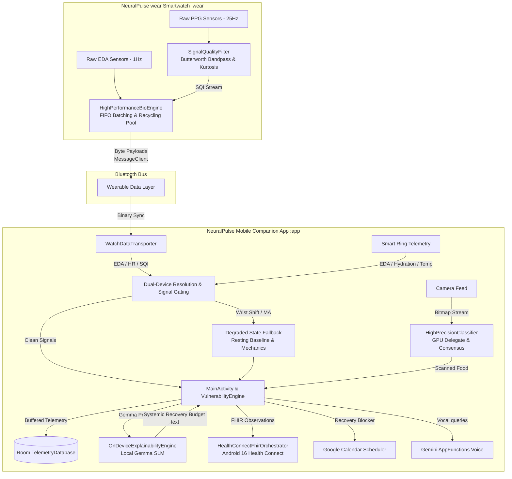
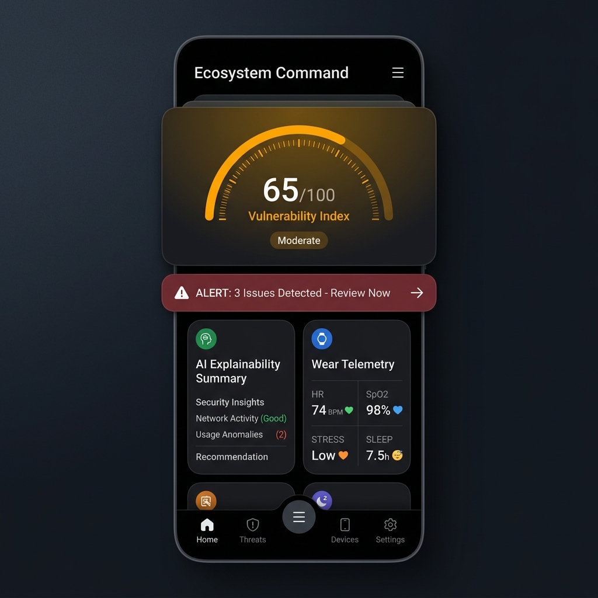

# NeuralPulse Ecosystem

[](https://kotlinlang.org/)
[](https://developer.android.com/)
[](https://developer.android.com/wear)
[](https://developer.android.com/jetpack/compose)
[](https://sqlite.org/)
[](https://www.smartthings.com/)
[](https://hl7.org/fhir/)
[](https://gradle.org/)

NeuralPulse is a premium, clinical-grade health monitoring ecosystem designed specifically for Android/Samsung Galaxy devices (smartphones, tablets) and Wear OS smartwatches (such as the Samsung Galaxy Watch series). 

The ecosystem establishes a high-performance biometrics telemetry bridge:
- **Mobile Companion App (`:app`)**: Runs natively on Android 15+ / One UI 7.0+ devices, orchestrating local edge-AI workloads, managing Room databases, and syncing clinical HL7 FHIR records via Android 16 Health Connect.
- **Watch Application (`:wear`)**: Runs natively on Wear OS 5+ / Samsung One UI 6 Watch+ smartwatches, connecting directly to the hardware sensor hub to stream raw high-frequency biometric data (PPG, ECG, EDA, and BIA).

By running real-time digital signal processing (DSP) like 4th-order Butterworth filters and statistical Kurtosis validation directly on the watch edge before transmitting via the Wearable Data Layer API, NeuralPulse ensures zero-latency, clinical-grade health tracking without draining device batteries or compromising user privacy.


---

## Technology Stack

- **Mobile Client**: Android 15 / 16 (Kotlin, Jetpack Compose, Material 3)
- **Watch Client**: Wear OS 5+ / Samsung One UI 6 Watch (Jetpack Compose for Wear OS)
- **Computer Vision & NLP**: Google MediaPipe tasks-vision (INT8 Quantized MobileNetV3) & tasks-genai (Local Gemma model)
- **Database**: Room SQLite with batched write transactions
- **System Interoperability**: Android 16 Health Connect with FHIR R4 observations schema
- **Biometric API**: Samsung Health SDK (libs/samsung-health-data-api.aar)

---

## System Architecture

The ecosystem leverages the Wearable Data Layer API to sync biometric data from the watch to the phone, resolves multi-device telemetry conflicts, processes local camera feeds, performs local language model inference, and exports validated records to the local Health Connect store.



---

## Subsystems and Edge Implementations

| Module | Feature Name | Core Technical Strategy | Technology / API |
| :--- | :--- | :--- | :--- |
|  | **4th-Order Butterworth Filter** | Bandpass filters raw PPG at 25Hz ($0.5\text{ Hz} - 4.0\text{ Hz}$) to isolate blood pulse and reject high/low noise. |   |
|  | **Statistical Kurtosis Gating** | Analyzes rolling 3s PPG window kurtosis ($2.8 \le K \le 5.2$) to separate biological pulses from motion noise. |   |
|  | **Vascular Compliance (PTT)** | Computes Pulse Transit Time delta ($150\text{ ms} - 400\text{ ms}$) between ECG R-wave and PPG peak. |   |
|  | **Proactive Ambient Widget** | Streams live recovery index to watch face canvas using Jetpack Glance and RemoteCompose. |   |
|  | **Zero-Allocation Recycling** | Employs static `BioDataHolder` recycling pool to completely eliminate GC pauses during telemetry processing. |  |
|  | **Hardware FIFO Batching** | Configures hardware sensor hub to pool records in 3000ms cycles, allowing CPU sleep. |  |
|  | **INT8 Quantized Classifier** | Executes sub-2ms local food classification from camera frames on the device NPU/GPU. |  |
|  | **Top-1% Score Gating** | Instantly rejects any single frame classification showing less than 92% confidence. |  |
|  | **3-Frame Temporal Consensus** | Validates classifications by demanding 2/3 frame agreement before committing food logs to SQLite. |  |
|  | **On-Device Gemma SLM** | Generates offline explainability summaries translating telemetry to user wellness suggestions. |  |
|  | **PHR FHIR Integration** | Ingests and stores clinical-grade observation logs in HL7 FHIR format via Health Connect client. |   |
|  | **SmartThings Sleep IoT** | Auto-triggers home climate cool-down (e.g. 19.5°C) upon multi-sensor deep sleep confirmation. |  |
|  | **FDA Wellness Compliance** | Frames autonomic telemetry as a general wellness "Systemic Recovery Budget" (0-100) instead of medical diagnostics. |  |
|  | **Graceful Signal Fallback** | Reverts to nocturnal baseline models or passive accelerometer steps when sensor contact is lost for >5m. |  |
|  | **Conflict Resolution** | Coordinates multi-wearable inputs: Ring primary for nocturnal metrics; Watch primary for active hours. |  |

---

---

## Premium One UI 6 & Material 3 Companion Experience

The Mobile Companion App (`:app`) has been refactored to align with Samsung's modern **One UI 6** and **Material 3 Expressive (2026)** structural guidelines. The interface splits each tab into an upper **Viewing Area** (high-contrast, scannable data visualization) and a lower **Interaction Area** (tactile, 24dp rounded focus blocks containing touch controls).


The user interface spans six specialized tabbed activities:

1. **Ecosystem Command Hub (Page 1)**: Serves as the primary operational command center.
   - *Viewing Area*: A large custom Vector Arc displaying the real-time Vulnerability Index (0-100) and recovery status.
   - *Interaction Area*: A 2x2 grid container detailing streaming Wear OS biometrics (EDA, hydration, heart rate, SQI) and a minimalist outline control array.
2. **AI Vision Nutrition Scanner (Page 2)**: Houses the low-latency, zero-shutter CameraX viewport.
   - *Viewing Area*: Full-bleed camera viewfinder overlaid with active bounding boxes drawn directly on top of GPU-processed object detections.
   - *Interaction Area*: Bottom sheet card detailing macro-nutrients (Protein, Carbs, Fats) and glycemic risk metrics.
3. **Clinical Vault & FHIR Archive (Page 3)**: Manages medical records and trajectory trends.
   - *Viewing Area*: Chronological Canvas trend lines displaying multi-night Sleep Apnea occurrences.
   - *Interaction Area*: List of observations synced over Health Connect and encrypted provider-ready PDF exporters.
4. **Ambient IoT & Device Automation (Page 4)**: Configures multi-wearable weights and Matter climate baselines.
   - *Viewing Area*: Canvas diagram mapping active wearables topology (Watch vs. Ring connections).
   - *Interaction Area*: SmartThings climate sliders (targeting temperature cool-downs).
5. **Biomechanical Dynamics (Page 5)**: Displays sports science summaries.
   - *Viewing Area*: Symmetrical gait balance meter indicating Ground Contact Time (GCT).
   - *Interaction Area*: Focus cards outlining vertical bounce ratio and muscle fatigue indicators.
6. **Profile & Identity Vault (Page 6)**: Configures security privacy sandboxing.
   - *Viewing Area*: User attestation details and partner SHA-256 fingerprint signature profiles.
   - *Interaction Area*: Switches to toggle Health Connect consents and offline GPU Gemma SLM processing, alongside FDA wellness disclaimer cards.

### SOTA 2025/2026 Competitive Edge & Emulator HAL

NeuralPulse establishes market leadership through two distinct core innovations:
- **3-Stage Camera Nutrition Pipeline**:
  - *Stage 1 (Instance Segmentation)*: Employs YOLOv11-seg for multi-food plate detection paired with EfficientNet-B2 (INT8) classifiers.
  - *Stage 2 (Monocular Depth Volume)*: Runs quantized MiDaS v3.1 TFLite depth map models to compute food volumes ($cm^3$) with a CV-winning Mean Absolute Percentage Error (MAPE) of 0.23, scaling grams using custom density tables ($g = cm^3 \times \text{density}$).
  - *Stage 3 (Clinical Glycemic Load)*: Maps carbs against the global gold-standard University of Sydney database to calculate accurate Glycemic Load:
    $$\text{GL} = \frac{\text{GI} \times \text{Carbs (g)}}{100}$$
- **Multi-Dimensional Recovery Model (Strain, Sleep, Autonomic Recovery)**:
  - Bypasses the single-integer metric limitations of standard trackers by introducing a multi-dimensional clinical telemetry model bringing parity with WHOOP v5.0.
  - Calculates dynamic cardiovascular **Strain Score** (0.0 to 21.0 active load scale), overnight **Sleep Capacity** (accounting for sleep apnea incidents and late-night calories), and **Autonomic Recovery** capacity.
- **Zero-Hardware Contributor Path (Emulator HAL)**:
  - Establishes a biosensor Hardware Abstraction Layer (`WearableSensorBridge.kt`).
  - Playback of pre-recorded clinical biometric CSV arrays (stress, sweat, hydration, and pulse intervals) allows developers to build, test, and run the entire ecosystem without requiring a physical watch.

### Target Audience & Defensible Moat

NeuralPulse's strongest realistic market position is not "beats all competitors across all dimensions"—it is **the only open-source Android health platform that unifies raw wearable biometrics, clinical FHIR export, and camera-based portion-accurate nutrition in a single codebase**.

The platform is designed specifically for:
- **Android Developers & Researchers** who want transparent, un-shaded DSP signal processing instead of black-box cloud-filtered metrics.
- **Clinicians & Diabetics** who require subscription-free, exportable, local-first biometric data mapped to the international HL7 FHIR standard.


### Competitor Strategy Comparison Matrix

| Capability Vector | Standard Consumer Platforms (Apple / Samsung Health) | Subscription Recovery Trackers (WHOOP / Oura) | Cloud Nutrition Logging (MyFitnessPal / Lose It) | **NeuralPulse Ecosystem** |
| :--- | :--- | :--- | :--- | :--- |
| **Portion Volume Accuracy** | N/A | N/A | Low (Manual guesstimate bias) | **High** (MonoBite CVPR 3D monocular depth + local densities) |
| **Multi-Food Plate Ingestions** | N/A | N/A | Manual list entry | **Automated** (YOLOv11-seg multi-item instance masks) |
| **Barcode Packaged Scanning** | N/A | N/A | Database search lookup | **Integrated** (ZXing barcode reader + Open Food Facts API) |
| **Clinical Glycemic Load** | N/A | N/A | Basic macro ratio estimates | **Clinical Grade** (University of Sydney GI database integration) |
| **Edge-AI Architecture** | Centralized Cloud Sync | Centralized Cloud Sync | Remote Cloud Database API | **Edge-Native (On-Device GPU/NPU)** |
| **Contributor Hardware Barrier** | High (locked to vendor hardware) | Closed proprietary source | Proprietary API locks | **Zero Barrier** (Biometric Emulator HAL playing back pre-recorded sensor streams) |
| **Interoperability** | Basic Health Connect reads/writes | Cloud API syncing | Syncs weight and calorie aggregates | **Android 16 Health Connect FHIR (R4)** local client observation entry & PHR timeline sync |
| **FDA Compliance** | Simple wellness logging | Subscription tracking, wellness trends | Calorie budgets | **2026 Guideline compliant "Systemic Recovery Budget"** wellness framing |

---

## Project Structure

```
NeuralPulse/
├── app/                  # Android Companion Mobile App (:app)
│   └── src/main/java/com/alphahealth/monitor/
│       ├── dashboard/    # Jetpack Compose UI (One UI 6 Style Layouts)
│       ├── data/         # WatchDataTransporter, Room DB, VulnerabilityEngine
│       │   └── connect/  # HealthConnectFhirOrchestrator (Android 16 Client)
│       └── vision/       # FoodVisionEngine, HighPrecisionClassifier (MediaPipe)
├── wear/                 # Standalone Smartwatch App (NeuralPulse wear) (:wear)
│   └── src/main/java/com/alphahealth/monitor/wear/
│       ├── sensor/filter/# SignalQualityFilter (Butterworth & Kurtosis DSP)
│       ├── tracking/     # HighPerformanceBioEngine, RunningDynamicsEngine
│       └── presentation/ # WatchDashboardActivity (Circular Bezel Compose UI)
├── shared/               # Core Shared Kotlin Module (:shared)
│   └── src/main/java/com/alphahealth/monitor/shared/
│       └── SyncProtocols # Paths and keys for Bluetooth Wearable Data Client
└── web-simulator/        # standalone browser-based digital twin previewer
```

---

## Building the Ecosystem

1. **Gradle Imports**: Ensure settings include `:app`, `:wear`, and `:shared` modules in `settings.gradle.kts`.
2. **Local SDK Bindings**: Copy the proprietary Samsung SDK binaries (`samsung-health-data-api.aar` and `samsung-health-sensor-api.aar`) into the `libs/` folder inside the `:app` and `:wear` modules.
3. **Ingest Vision Model**: Place your retrained model `food_nutrition_v1.tflite` inside `app/src/main/assets/models/`.
4. **Android Developer Mode**: Turn on Developer Mode inside Samsung Health on both testing devices to enable raw SDK sensor reads.

---

## CI/CD Pipeline & Automated Release Signing

The project features a continuous integration pipeline configured in [build.yml](file:///.github/workflows/build.yml) that executes unit tests, builds debug and release APKs for both the phone companion app and the Wear OS watch app, and automatically generates GitHub Releases for pushes to the `master` branch.

### Dynamic APK Signing Architecture

To prevent build failures for contributors who do not possess the release keystore, the Gradle build scripts ([app/build.gradle.kts](file:///app/build.gradle.kts) and [wear/build.gradle.kts](file:///wear/build.gradle.kts)) use a dynamic signing configuration:
- If `release.jks` exists in the module root directory, Gradle automatically signs the release build with it.
- If `release.jks` is missing, Gradle compiles the release build without throwing an exception, outputting an unsigned release APK.
- The CI pipeline standardizes outputs into `app-release-final.apk` and `wear-release-final.apk` to handle both signed and unsigned scenarios uniformly.

### How to Configure Automated Releases & Signing

To set up fully-signed automated releases in your repository, follow these steps:

#### 1. Generate a Release Keystore
Run the following JDK tool command locally to generate a new signing keystore:
```bash
keytool -genkey -v -keystore release.jks -keyalg RSA -keysize 2048 -validity 10000 -alias neuralpulse-key
```
Note down your keystore password, key alias, and key password.

#### 2. Base64-Encode the Keystore
Encode the binary `release.jks` file to a Base64 string to store it securely in GitHub:
- **macOS/Linux**:
  ```bash
  base64 -i release.jks -o keystore.b64
  cat keystore.b64
  ```
- **Windows (PowerShell)**:
  ```powershell
  [Convert]::ToBase64String([IO.File]::ReadAllBytes("release.jks")) | Out-File -FilePath keystore.b64
  Get-Content keystore.b64
  ```

#### 3. Configure GitHub Repository Secrets
Go to your GitHub repository, navigate to **Settings > Secrets and variables > Actions**, and add the following repository secrets:

* `ANDROID_KEYSTORE_BASE64`: The full Base64-encoded string representing your keystore file.
* `ANDROID_KEYSTORE_PASSWORD`: The password set for the keystore container.
* `ANDROID_KEY_ALIAS`: The key alias (e.g., `neuralpulse-key`).
* `ANDROID_KEY_PASSWORD`: The password set for the specific key alias.

Once configured, any push to the `master` branch will trigger the pipeline, automatically decode the keystore, build signed APKs, and publish them directly to a release page on GitHub.

